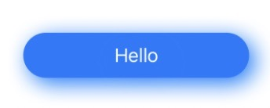
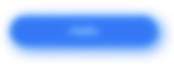
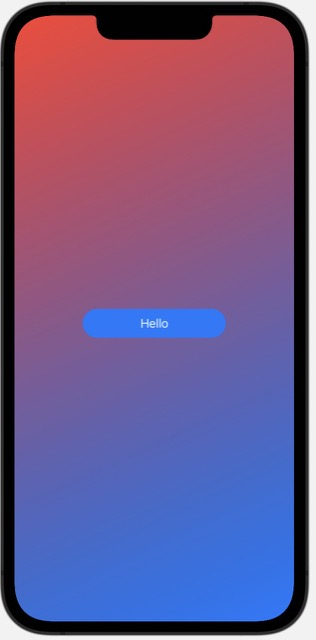
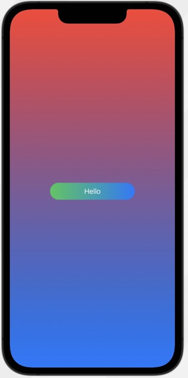
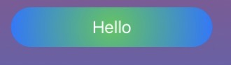
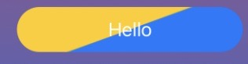
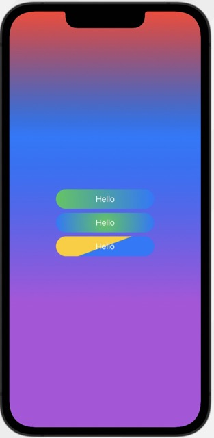

#  Design M1L4: Gradients, Drop Shadows, Blurs
Notes based on the excellent Code with Chris website Design module one lesson four. Highly recommend
anyone learning Swift to sign up! You will not have a better and more comprehensive teacher than Chris:
https://learn.codewithchris.com/courses/take/design/lessons/25824132-lesson-4-gradients-drop-shadows-and-blurs

# Table of contents
- [Design M1L4: Gradients, Drop Shadows, Blurs](#design-m1l4-gradients-drop-shadows-blurs)
- [Shapes](#shapes)
  - [Blue Button with Drop Shadow](#blue-button-with-drop-shadow)
  - [Blur](#blur)
  - [Linear Gradient](#linear-gradient)
  - [Radial Gradients](#radial-gradients)

# Shapes
## Blue Button with Drop Shadow
You can create a special button, even one with its own color of shadow 
as well as a shadow to the bottom-right, versus the standard down with
the following code:
```
ZStack {
    Capsule()
        .foregroundColor(.blue)
        .frame(width: 200, height: 40)
    Text("Hello")
        .foregroundColor(.white)
}
// Place a shadow in the color blue five right and down from center
.shadow(color: .blue, radius: 10, x: 5, y: 5)
```


## Blur
Meanwhile, you sometimes need to blur out the background, if you have a modal
or sheet pop-up on the screen. With that you can simply apply the `.blur(radius: 5)`, or
set any radius you choose on the elements you want to blur:


## Linear Gradient
Instead, of using a fancy graphic, we can apply a custom gradient as our background!
Here we create a gradient with a list of colors, red and blue, but they could be many. 
Then, we make the gradient start from the top-left with `.topLeading` and finish at the
bottom right with `.bottomTrailing`:
```
LinearGradient(
    gradient: Gradient(
        colors: [.red, .blue]),
    startPoint: .topLeading,
    endPoint: .bottomTrailing
)
// Ignore the safe area to use the whole screen
    .ignoresSafeArea()
```


In addition, you can use a `UnitPoint` to create a custom start/ stop point for the app. The 
image below starts at the top center, then goes to the bottom center:
```
LinearGradient(
    gradient: Gradient(
        colors: [.red, .blue]),
    // Ranges from zero to one with 1 all the way at the right for X
    // Or 1 all the way at the bottom for y
    startPoint: UnitPoint(x: 0.5, y: 0),
    endPoint: UnitPoint(x: 0.5, y: 1)
)
// Ignore the safe area to use the whole screen
    .ignoresSafeArea()
```


### Gradient Button
We can even use a gradient as the fill for our button by replacing the 
`.foreground` modifier with the `.fill` modifier, where we place a Linear Gradient inside:
```
Capsule()
    .fill(
        LinearGradient(gradient: Gradient(
            colors: [.green, .blue]),
                       startPoint: .leading,
                       endPoint: .trailing
                      )
    )
    .frame(width: 200, height: 40)
Text("Hello")
    .foregroundColor(.white)
```


## Radial Gradients
Another form of gradient goes out in a circle or radius from a starting point like
the center. The bottom radient here goes out 100 pixels from 0 its starting point:
```
ZStack {
    Capsule()
        .fill(
            RadialGradient(
                colors: [.green, .blue],
                center: .center,
                startRadius: 0,
                endRadius: 100
            )
        )
        .frame(width: 200, height: 40)
    Text("Hello")
        .foregroundColor(.white)
}
``` 


### Angular Gradient
You can specify specific angles to start and end gradients as well:
```
ZStack {
    Capsule()
        .fill(
            AngularGradient(
                colors: [.blue, .yellow],
                            center: .center,
                startAngle: Angle(degrees: 160),
                endAngle: Angle(degrees: 160)
            )
        )
        .frame(width: 200, height: 40)
    Text("Hello")
        .foregroundColor(.white)
}
```


### Gradient Stops
You can also control with fine precision the start of each gradient. Instead, of allowing
the colors to blend into one another automatically, you can specify at the points you want them to
start. It works on a scale from zero to one with zero being the top, and one the bottom. 
 ```
 LinearGradient(
    gradient: Gradient(stops: [
        .init(color: .red, location: 0),
        .init(color: .blue, location: 0.3), // Starts point three away
        .init(color: .purple, location: 0.7)
    
    ]),
    // Ranges from zero to one with 1 all the way at the right for X
    // Or 1 all the way at the bottom for y
    startPoint: UnitPoint(x: 0.5, y: 0),
    endPoint: UnitPoint(x: 0.5, y: 1)
)
 ```
 
